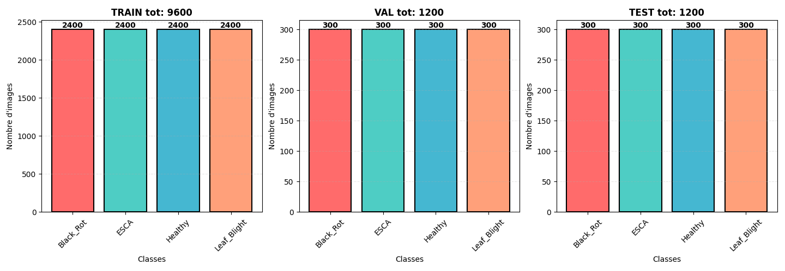
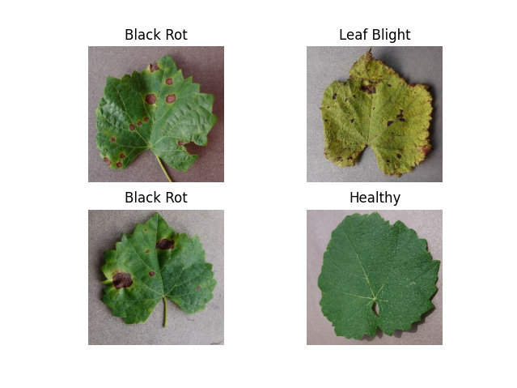
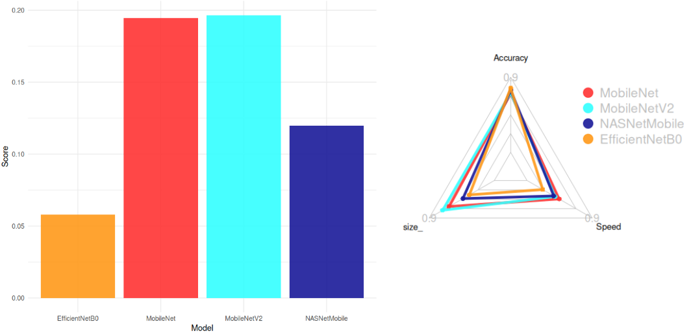
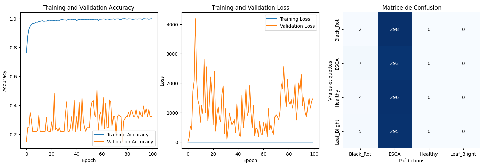
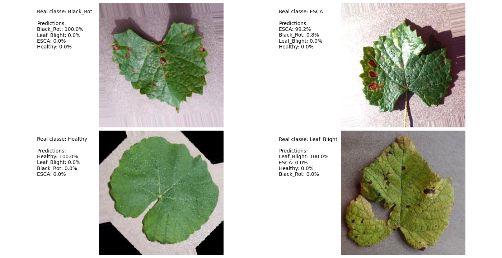
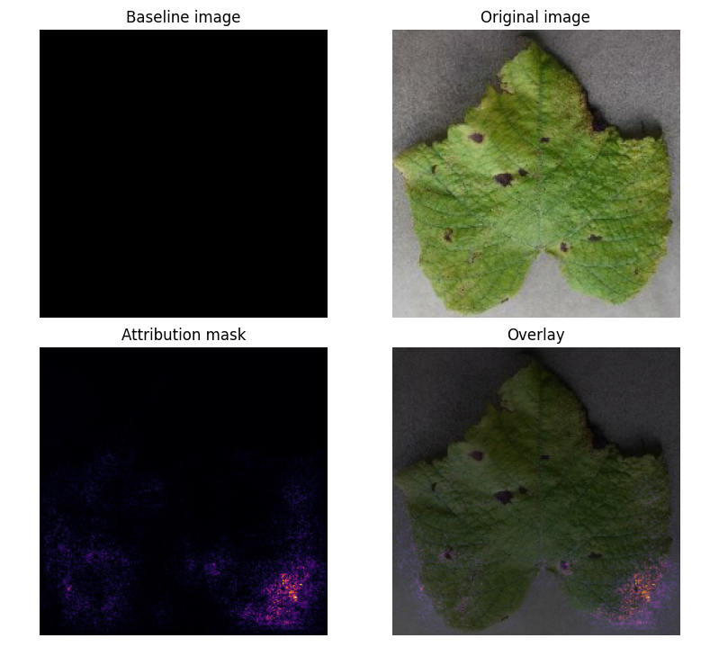

# Tensorflow Grapevine Disease Detection  

## Description  
This project develops a mobile application for detecting diseases on grapevines using a Deep Learning model. The implementation leverages TensorFlow and Keras to build a CNN-based classifier for identifying three common diseases: 
Black Rot, ESA (Net Blight), and Leaf Blight.  


## 📁 Dataset  

The dataset originates from [Kaggle](https://kaggle.com/datasets/rm1000/grape-disease-dataset-original), containing **9,027 images** of grapevine leaves. The diseases are categorized as:  
- **Black Rot**  
- **ESCA (Net Blight)**  
- **Leaf Blight**  

<<<<<<< HEAD
The dataset is **well-balanced** with a slight overrepresentation of **ESCA** and **Black Rot**. All images are in **.jpeg format** with dimensions **256x256 pixels**.  
=======
## Model Structure 
>>>>>>> fe70005a86f7095d5e60f104bd6a3e22f50c2dac

  <br>

 <br>

## 📊 Model Architecture Selection  

We evaluated pre-trained models from [`keras applications`](https://keras.io/api/applications/#usage-examples-for-image-classification-models) to balance **accuracy**, **model size**, and **inference speed**. The selection criteria included:  
- **Maximize accuracy**  
- **Minimize size** (1/size)  
- **Maximize CPU speed** (1/CPU Time)  

The **score formula** used for selection was:  
$Score = \frac{Accuracy}{Size . CPU Time}$ 

**Top Models (Score > 0.05):**  
1. **MobileNetV2** (Smallest: 14 MB, High Accuracy: 77%)  
2. **MobileNet** (Fastest: 22.6 ms)  
3. **NASNetMobile**  
4. **EfficientNetB0**  

**Conclusion:**  
`MobileNetV2` was chosen for its optimal balance between accuracy, size, and speed.  

<br>


## 🍇 Grapevine Diseases  

### **Key Diseases:**  
1. **Black Rot**  
2. **ESCA (Net Blight)**  
3. **Leaf Blight**  

## 🤖 Model Structure  

### **Architecture:**  
```python
# Auto Stop
early_stopping = EarlyStopping(monitor="val_loss", min_delta=0.2, patience=10)

# Model
model = Sequential()
model.add(tf.keras.applications.MobileNetV2(
    input_shape=(IMG_HEIGHT, IMG_WIDTH, CHANNELS),
    include_top=False, 
    weights='imagenet'
))
model.add(tf.keras.layers.GlobalAveragePooling2D())
model.add(tf.keras.layers.Dense(100, activation='relu'))
model.add(tf.keras.layers.Dense(100, activation='relu'))
model.add(tf.keras.layers.Dense(NUM_CLASSES, activation='softmax'))

optimizer = tf.keras.optimizers.Adam(learning_rate=LEARNING_RATE)

model.compile(
    optimizer=optimizer,
    loss=tf.keras.losses.SparseCategoricalCrossentropy(from_logits=True),
    metrics=['accuracy']
)
```

**Parameters:**  
- **Total params:** 7.12M (27.17 MB)  
- **Trainable params:** 2.36M (9.01 MB)  
- **Non-trainable params:** 34.11K (133.25 KB)  


## 🛠️ Training Details  

- **Batch Size:** 32  
- **Epochs:** 100 (reduced to 25 via early stopping)  
- **Data Augmentation:** Not used (insufficient improvement in accuracy)  
- **Normalization:** Pixel values normalized to [0, 1]  


## 📊 Results  

### **Performance:**  
- **Validation Accuracy:** ~99.9%  
- **Confusion Matrix Analysis:**  
  - Model biased toward **ESCA** and **Healthy** classes.  
  - Suspected causes:  
    1. Original dataset imbalance  
    2. Similar visual features across diseases  

  

### **Prediction Example:**  
  

### **Attribution Mask:**  
  
- **Key Insight:** Model focuses on leaf shape rather than disease-specific features (e.g., black spots).  


### 📚 ressources: 

https://www.kaggle.com/code/ahmedmsaber/grape-leafs-diseases-mobilenetv2-val-acc-99 <br>
https://www.tensorflow.org/tutorials/images/classification?hl=en <br>
https://www.tensorflow.org/lite/convert?hl=en <br>
https://www.tensorflow.org/tutorials/interpretability/integrated_gradients?hl=en <br>

🤖AI(s) : deepseek-coder:6.7b | deepseek-r1:8b


