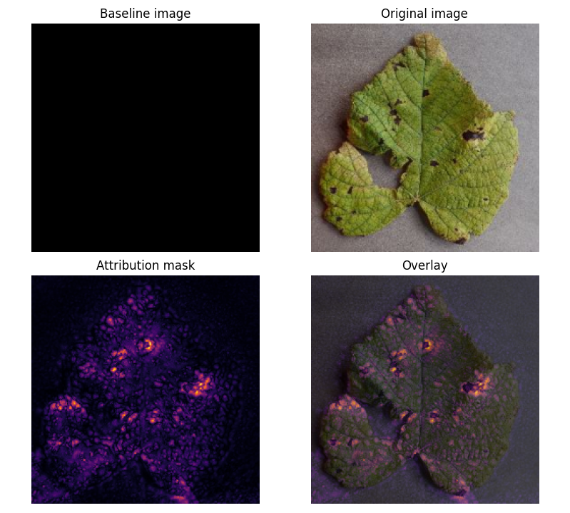

# Tensorflow Grapevine Disease Detection

This document outlines the development of a modile application that uses a DeepLearning model de detect diseases on grapevine.

## Dataset

The data used in this study is split into training, validation, and testing sets ensuring a robust evaluation of our model's performance. The dataset consists of a set of 9027 images of three disease commonly found on grapevines: 
**Black Rot**, **ESCA**, and **Leaf Blight**, balanced with equal representation across the classes. Images are in .jpeg format with dimensions of 256x256 pixels.

## Model Structure

Our model is a Convolutional Neural Network (CNN) built using Keras API with TensorFlow backend. It includes several convolutional layers followed by batch normalization, ReLU activation function and max pooling for downsampling. 
Dropout layers are used for regularization to prevent overfitting. The architecture details and parameters are as follows: 

| Layer (type)                         | Output Shape               | Param #  |
|--------------------------------------|-----------------------------|----------|
| sequential                           | (None, 224, 224, 3)        |    0     |
| conv2d                               | (None, 224, 224, 32)       |    896   |
| batch_normalization                  | (None, 224, 224, 32)       |    128   |
| conv2d_1                             | (None, 224, 224, 32)       |    9248  |
| batch_normalization_1                 | (None, 224, 224, 32)       |    128   |
| max_pooling2d                        | (None, 112, 112, 32)       |    0     |
| dropout                              | (None, 112, 112, 32)       |    0     |
| conv2d_2                             | (None, 112, 112, 64)       |    18496 |
| batch_normalization_2                 | (None, 112, 112, 64)       |    256   |
| conv2d_3                             | (None, 112, 112, 64)       |    36864 |
| batch_normalization_3                 | (None, 112, 112, 64)       |    256   |
| max_pooling2d_1                      | (None, 56, 56, 64)         |    0     |
| dropout_1                            | (None, 56, 56, 64)         |    0     |
| conv2d_4                             | (None, 56, 56, 128)        |    73728 |
| batch_normalization_4                 | (None, 56, 56, 128)        |    512   |
| conv2d_5                             | (None, 56, 56, 128)        |    147584|
| batch_normalization_5                 | (None, 56, 56, 128)        |    512   |
| max_pooling2d_2                      | (None, 28, 28, 128)        |    0     |
| dropout_2                            | (None, 28, 28, 128)        |    0     |
| conv2d_6                             | (None, 28, 28, 256)        |    294912|
| batch_normalization_6                 | (None, 28, 28, 256)        |    1024   |
| conv2d_7                             | (None, 28, 28, 256)        |    590080|
| batch_normalization_7                 | (None, 28, 28, 256)        |    1024   |
| max_pooling2d_3                      | (None, 14, 14, 256)        |    0     |
| dropout_3                            | (None, 14, 14, 256)        |    0     |
| global_average_pooling2d             | (None, 256)                |    0     |
| dense                                | (None, 256)                |    65792 |
| batch_normalization_8                 | (None, 256)                |    1024   |
| dropout_4                            | (None, 256)                |    0     |
| dense_1                              | (None, 128)                |    32768 |
| batch_normalization_9                 | (None, 128)                |    512   |
| dropout_5                            | (None, 128)                |    0     |
| dense_2                              | (None, 4)                  |    516    |

 Total params: 3,825,134 (14.59 MB)
 Trainable params: 1,274,148 (4.86 MB)
 Non-trainable params: 2,688 (10.50 KB)
 Optimizer params: 2,548,298 (9.72 MB)

## Training Details

Training was done using a batch size of 32 over 100 epochs. Data augmentation methods include horizontal/vertical flip (RandomFlip), rotation (RandomRotation), zooming (RandomZoom) and rescaling (Rescaling). Pixel values are 
normalized to the range [0, 1] after loading.

## Results

Our best model's performance has an average accuracy of roughly 30% on the validation set. This suggests potential overfitting towards the **ESCA** class. However, the model can identify key features that distinguish all classes: 
marks on the leaves (fig.4).

### Prediction Example 

### Attribution Mask 

The attribution mask provides an insight into what features the model has learned to extract from each image, which can be seen in figure 4. This can help guide future work on improving disease detection and understanding how the 
model is identifying key features for accurate classification.

### ressources: 

https://www.tensorflow.org/tutorials/images/classification?hl=en
https://www.tensorflow.org/lite/convert?hl=en
https://www.tensorflow.org/tutorials/interpretability/integrated_gradients?hl=en

AI(s) : deepseek-coder:6.7b | deepseek-r1:8b

